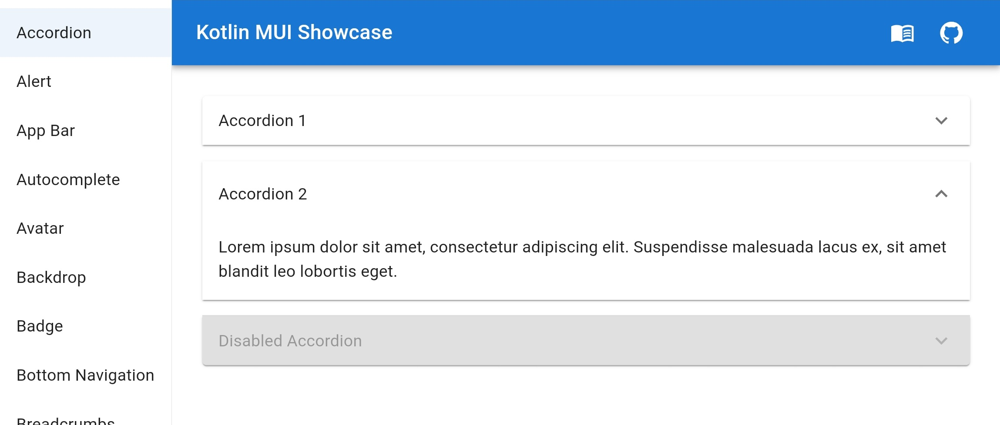
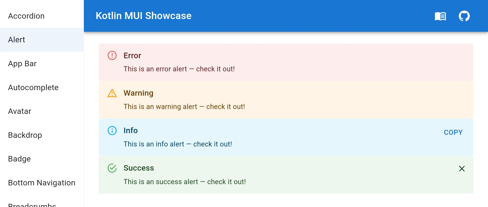
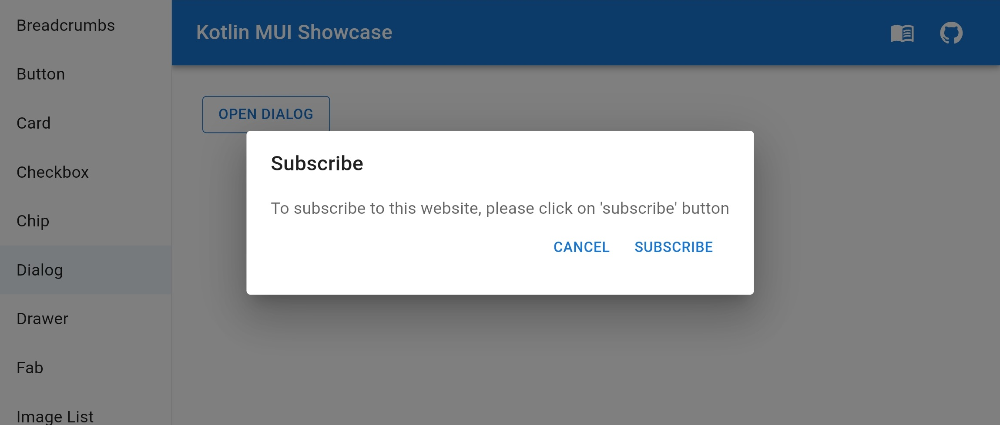
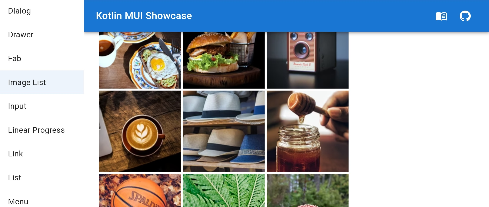
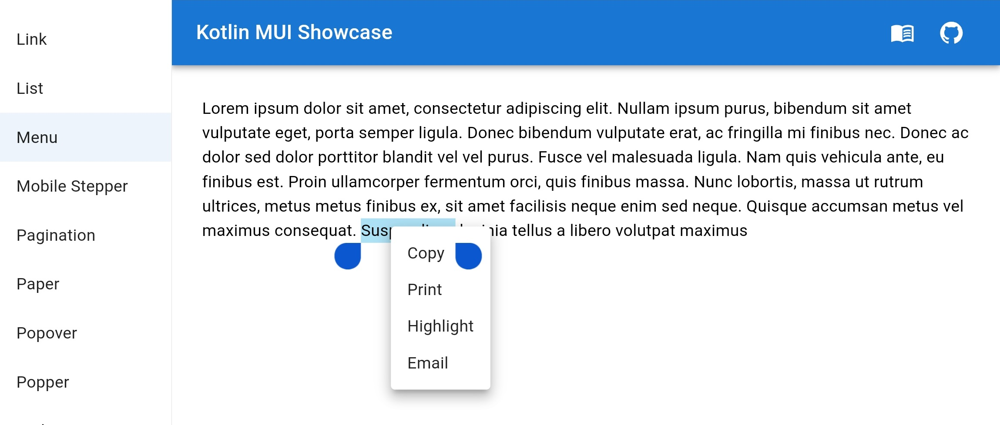
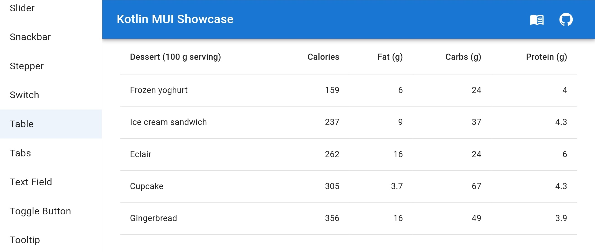

# Kotlin MUI Showcase

>>>>> For a simple and quick start of a Kotlin/JS project, feel free to check out another project of mine – [Kotlin React Table Sample](https://github.com/aerialist7/kotlin-react-table-sample)

### Demo Stand of Kotlin/JS Material-UI

This project uses official Kotlin MUI Wrappers:

- [MUI](https://github.com/JetBrains/kotlin-wrappers/tree/master/kotlin-mui)
- [MUI Icons](https://github.com/JetBrains/kotlin-wrappers/tree/master/kotlin-mui-icons)

#### App Snapshots

> 
> 
> 
> 
> 
> 

----

## Useful commands

### Clean

```sh
./gradlew clean
./gradlew --stop
```

### Build

```sh
./gradlew build
```

### Run

```sh
./gradlew jsBrowserDevelopmentRun -t
```

### Gradle Wrapper update

```sh
./gradlew wrapper
```
